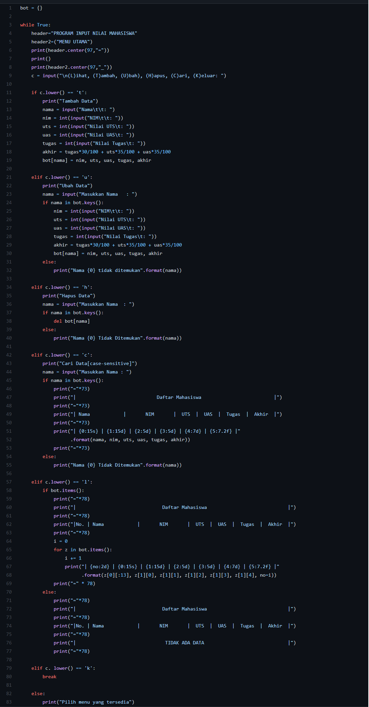
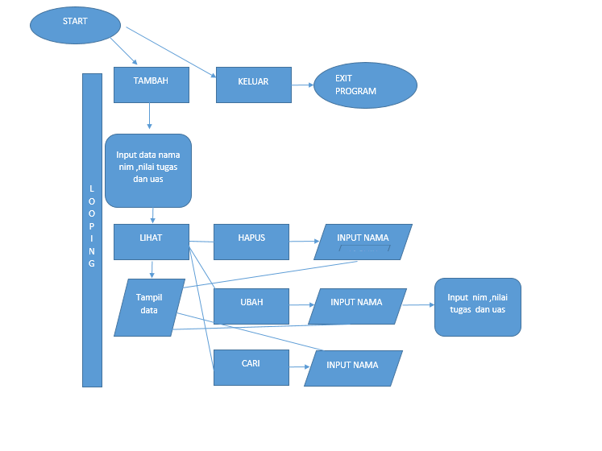

# Praktikum5

Program Data Mahasiswa
Membuat data Mahasiswa menggunakan Dictionary dengan python

NAMA : RIO SAPUTRA
KELAS : T.21.CI
NIM : 312110533

UNIVERSITAS PELITA BANGSA

## Source Code

### Penjelasan
1) Pertama kita membuat sebuah dictionary kosong yang nantinya akan diinputkan data ketika program dijalankan.

2) Lalu kita membuat kondisi perulangan dam sebuah keterangan untuk pilihan menu yang akan menjalankan program

3) Membuat syntax untuk menambahkan data. Disini apabila kita menginputkan 't' maka kita akan diminta untuk menginputkan beberapa data. Data yang kita inputkan akan masuk ke dictionary 'x' yang telah dibuat tadi dengan data 'nama' sebagai keys dan sisanya sebagai valuesnya.

4) Memebuat syntax untuk mengubah data. Apabila kita menginput 'u' maka akan ada keterangan untuk mengubah data dan kita akan diminta untuk menginputkan nama yang mau diubah datanya, apabila nama tidak ada maka outputnya "Nama{} tidak ditemukan". Dimana {} adalah nama/data yag mau kita ubah.

5) Membuat syntax untuk menghapus data.
Apabila kita menginput 'h' maka kita akan diminta menginputkan nama yang akan dihapus. jika nama ada di dalam dictionary, maka system akan menghapus keys/nama tersebut beserta valuesnya pada statement delx[nama ].

6) Membuat syntax untuk mencari data.
Apabila kita menginputkan 'c' maka akan diminta untuk memasukan nama yang dicari. Apabila nama yang dicari ada di dalam dictionary maka outputunya akan menampilkan data dari nama tersebut.

7) Membuat syntax untuk melihat atau menampilkan data.
Apabila kita menginputkan 'l' maka sistem akan menampilkan data-data yang sudah kita masukan. jika kita belum memasukan data maka outputnya menjadi "TIDAK ADA DATA"

8) Membuat syntax untuk menghentikan perulangan.
Apabila kita menginputkan 'k' maka program akan langsun berhenti

9) Membuat syntax untuk apabila memilih pilihan yang tidak ada di menu

Jika kita menginputkan selain yang ada pada menu (t,u,h,c,l,k) maka kita akan diminta untuk memilih menu yang tersedia

## FLOWCHART

## Output Program
